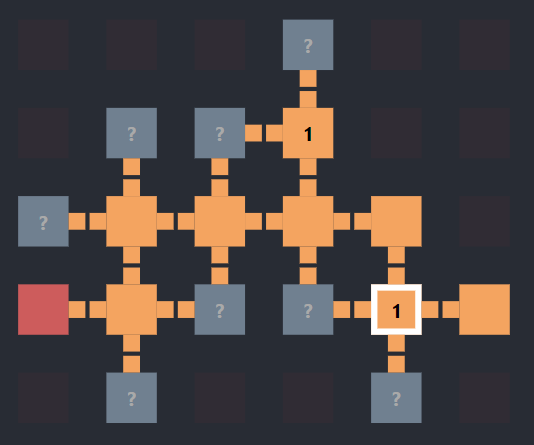

# vault-hunters-map-tracker

This project is a companion app for people who play [Vault Hunters 3rd Edition](https://www.curseforge.com/minecraft/modpacks/vault-hunters-1-18-2), and would like to track their progress in the vaults together.

## Usage

Install dependencies:

### `npm install`

Then build the `client` and `server` apps with:

### `npm run build`

Finally, you can start the server with:

### `npm run start`

Good luck in the vaults!
